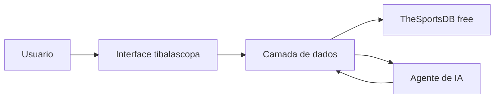

# Arquitetura Tecnica

## Visao geral

O tibalascopa foi organizado em camadas para manter a interface, a integracao com dados e a logica do agente separadas.

## Camadas

### Interface

- home editorial
- paginas de jogos, jogadores, historico e agente
- componentes reutilizaveis

### Integracao de dados

- camada central em `lib/thesportsdb.ts`
- rotas internas em `app/api/football/*` como proxy/contrato interno
- normalizacao dos retornos da API antes de chegar ao front

### IA

- agente com contexto das consultas reais
- resposta com fonte e incerteza quando necessario

### Persistencia futura

- banco de dados opcional para cache duravel, auditoria e historico

## Fluxo

## Regras

- o front nao fala direto com a API externa
- toda resposta precisa ser rastreavel
- cache leve e tratamento de erro sao obrigatorios
- nao existe mock no fluxo principal
